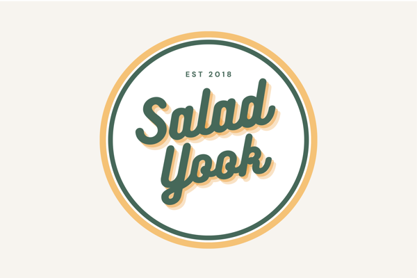
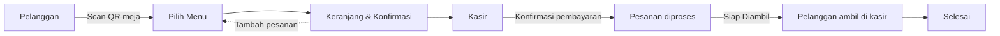
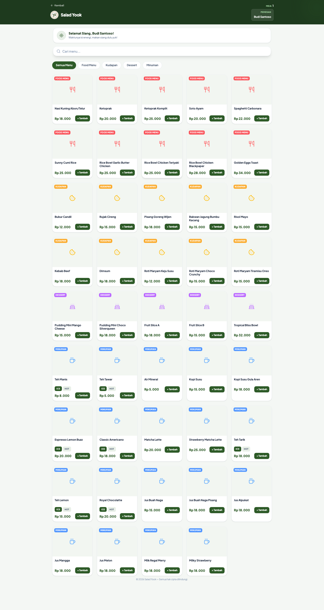
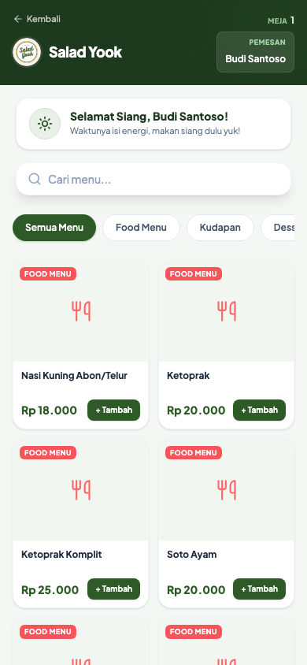
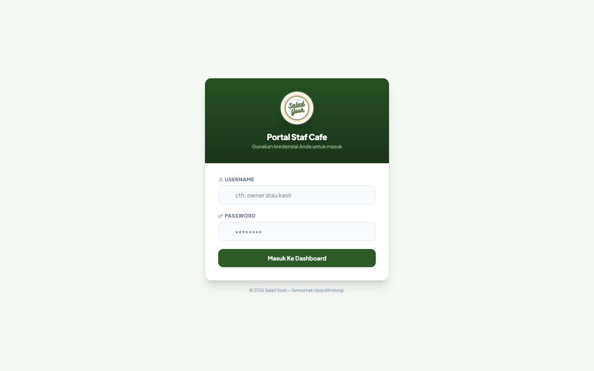
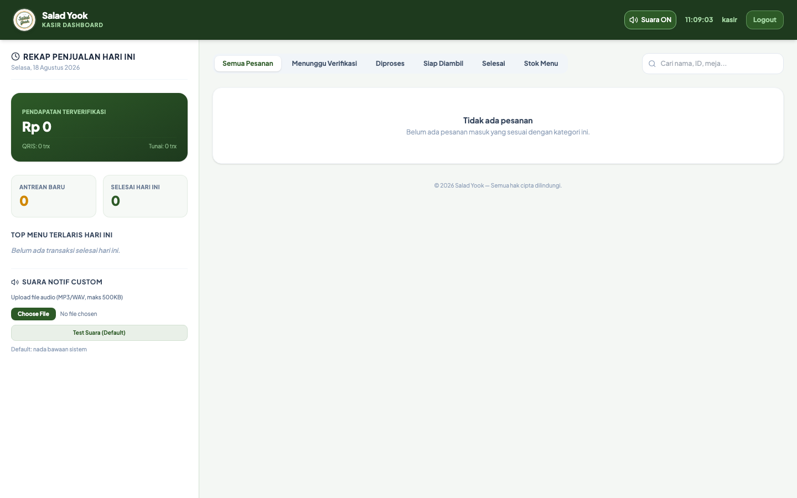
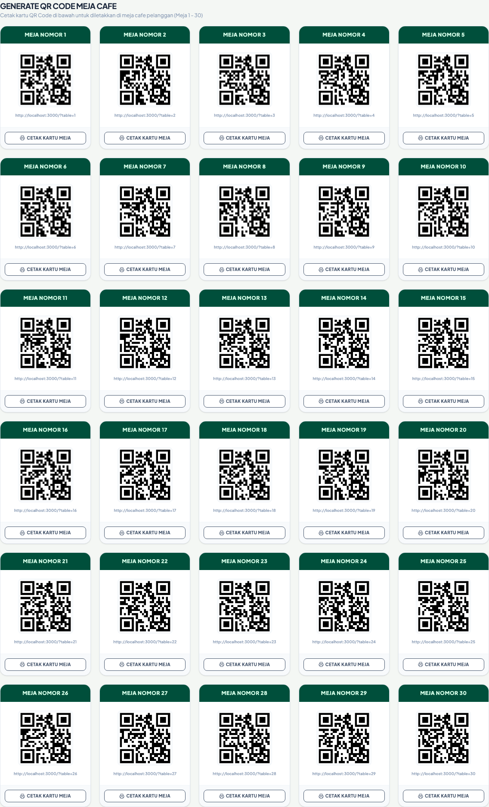
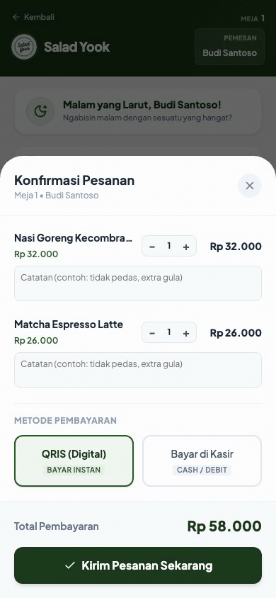

<p align="center">
  
</p>

<h1 align="center">Salad Yook — Sistem Pemesanan Cafe (QR Self-Order)</h1>

<p align="center">
  <strong>🇮🇩 Indonesia</strong> · <a href="README.en.md">🇬🇧 English</a>
</p>

<p align="center">
  <a href="https://salad-yook.web.id" target="_blank" rel="noopener">
    
  </a>
</p>

<p align="center">
  
  
  
  
  
  
  
  
  
</p>

<p align="center">
  Aplikasi pemesanan menu digital berbasis <b>QR Code</b> untuk kafe. Pelanggan scan QR meja → memesan dari HP → kasir mengonfirmasi → pesanan siap diambil, dengan pemberitahuan pager wireless Kolmi.
</p>

---

## Alur Sistem



## Preview

**Pelanggan**

<p align="center">
  
  
</p>

**Staf & Kasir**

<p align="center">
  
  
</p>

**QR Self-Order**

<p align="center">
  
</p>

**Alur pemesanan**

<p align="center">
  
</p>

> Screenshot di atas adalah hasil bawaan (`seed`). Screenshot terbaru bisa di-generate ulang dengan `npm run screenshots`.

---

## Fitur Utama

| | |
|---|---|
| **Pelanggan** | Scan QR meja, pilih menu, keranjang, konfirmasi sebelum bayar, pantau status pesanan real-time, tambah pesanan (self-service), bayar QRIS/tunai. |
| **Kasir** (`/staff`) | Kelola pesanan, konfirmasi pembayaran, set "Siap Diambil", tambah/batal item, cetak struk, notifikasi suara pesanan baru. |
| **Owner** (`/staff`) | Laporan pendapatan (export CSV), kelola menu & stok, kelola akun staf, QR meja, pengaturan kafe & QRIS. |
| **Admin / Godmode** (`/godmode`) | Pemantauan jarak jauh — Log & Aktivitas (error & event), Akses Hari Ini (perangkat + manusia vs AI/bot), Wrangler Info. |
| **Keamanan** | Role terpisah, JWT httpOnly, rate limit, validasi transisi status, ID pesanan unik, sandi ter-hash, backup otomatis. |

## Teknologi

- **Frontend:** React 19 + Vite + Tailwind CSS + Motion (animasi) + Lucide (ikon)
- **Backend Cloudflare:** Hono + D1 (SQLite) + Workers Assets
- **Backend lokal/alternatif:** Express + better-sqlite3
- **Deploy:** Cloudflare Workers

## Kebutuhan

- Node.js **LTS v24** (lihat `.nvmrc`; jalankan `nvm use` di folder ini)

## Menjalankan Lokal

```bash
npm install
npm run dev                 # Express, port 3000 (stabil untuk uji lokal/HP)
# atau
npm run build && npx wrangler dev --port 8787    # Worker (emulasi lokal)
npm run dev:lan             # Worker dapat diakses dari HP (WiFi sama)
```

**Akses:**
- Halaman customer: `http://localhost:3000/?table=1`
- Portal owner/kasir: `http://localhost:3000/staff`
- Portal admin: `http://localhost:3000/godmode`

> Catatan: `wrangler dev` (emulasi lokal miniflare) bisa crash intermittent di sebagian mesin — ini **bukan** masalah kode dan **tidak terjadi di produksi**. Untuk kerja lokal gunakan `npm run dev`.

## Akun & Sandi Awal

- **Sandi awal (owner/kasir/admin) ada di file lokal `.credentials.local`** — file ini **tidak ikut di repo** (aman).
- **WAJIB ganti semua sandi bawaan segera setelah login pertama** sebelum menyerahkan ke pengguna/pembeli:
  - Admin → `/godmode` → Pengaturan Cafe → "Ubah Sandi Saya"
  - Owner/Kasir → `/staff` → Kelola Akun Staf

## Deploy ke Cloudflare

```bash
npm run deploy:prod         # = bash scripts/deploy-cloudflare.sh
```

Script otomatis: build → buat/ambil D1 → migrasi schema → pastikan akun admin → set `JWT_SECRET` (acak) → `wrangler deploy`.

**Setelah deploy (wajib):**
1. Buka `.credentials.local` untuk sandi awal.
2. Login admin di `/godmode` → ganti sandi.
3. Ganti sandi owner/kasir di `/staff`.
4. Uji alur scan → pesan → siap diambil → selesai.

## Keamanan & Backup

- Backup D1: `npm run backup:d1`
- Backup akun staf: `npm run backup:users`
- Reset penjualan (aman, hanya arsip): `npm run reset:orders`
- Pantau error & akses: login admin → `/godmode`
- Log live: `npx wrangler tail`
- Perbaiki data: Dashboard Cloudflare → D1 → Console

## Dokumentasi

- `docs/DEPLOY-CHECKLIST.md` — checklist deploy & monitoring
- `docs/PRODUCTION.md` — panduan operasional & maintenance
- `docs/BUG-REPORT-wrangler.md` — laporan bug `wrangler dev` (emulasi lokal)

---

<p align="center">Dibuat dengan fokus pada kesederhanaan dan kemudahan pemakaian.</p>
